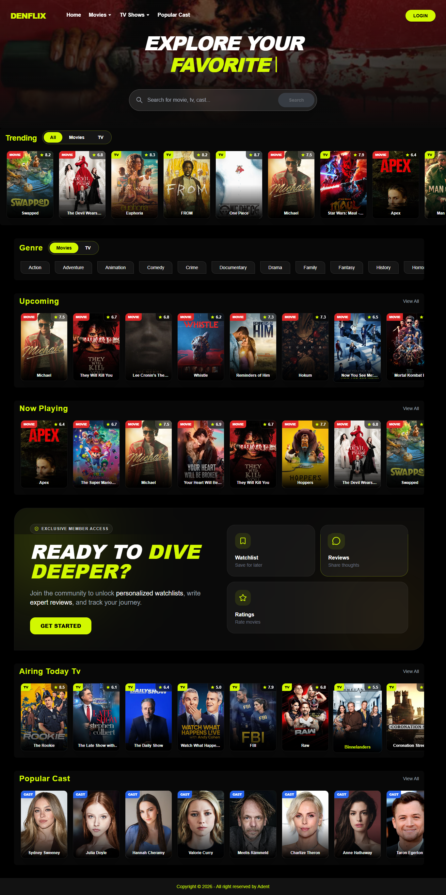

<p align="center">
  
</p>

<h1 align="center">DENFLIX</h1>

<p align="center">
  Modern Movie & TV Discovery App built with React, Firebase & TMDB API
</p>

<p align="center">
  <a href="https://den-flix.vercel.app">🌐 Live Demo</a>
</p>

---

## ✨ Overview

**Denflix** is a modern movie discovery web application designed to help users explore movies, TV series, and cast information in a seamless and engaging way. 

It allows users to save bookmarks, write and manage reviews, and interact with content—all in one place.

Denflix emphasizes user experience, real-time interaction, and clean, modern UI design, making it a powerful companion for discovering and tracking entertainment content.

> ⚠️ Streaming is not included due to licensing restrictions and TMDB API limitations.

---

## 🚀 Features

- 🎬 **Movie** (Trending, Popular, Now Playing, Upcoming, Top Rated)
- 📺 **TV Shows** (Trending, Popular, Airing Today, On Tv, Top Rated)
- 📺 **Popular Cast Discovery**
- ⭐ **User Rating & Review System** (Realtime - Firebase & CRUD)
- 🔖 **Bookmark** (Save and manage favorite movies)
- 🎥 **Trailer Preview** (YouTube via TMDB)
- 🔐 **Google Authentication** (Firebase)
- 👤 **Profile Management** 
- ⚡ **Fast & Responsive UI** (React + Tailwind)
- 🎨 **Modern Dark UI** (Glassmorphism style)

---

## 🛠️ Tech Stack

| Category        | Technology |
|----------------|-----------|
| Frontend       | React.js (Vite) |
| Styling        | Tailwind CSS + DaisyUI |
| Backend (BaaS) | Firebase (Auth, Firestore, Storage) |
| API            | TMDB API |
| HTTP Client    | Axios |
| Routing        | React Router |
| Animation      | Framer Motion |
| Notification   | SweetAlert2 / React Hot Toast |

---

## 📸 Screenshot

<p align="center">
  
</p>

---

## 🔐 Authentication

- Google Sign-In (Firebase)
- Protected routes (Bookmark, Review, Profile)
- User-specific data handling

---

## 🛠️ Installation

- Clone repository
 ```sh
  git clone https://github.com/yourusername/denflix.git
   ```

- Install dependencies
 ```sh
  npm install
   ```

- 🔑 Environment Variables (Create a `.env` file and fill it in like this :)
 ```env
  VITE_APP_API_KEY=your_tmdb_api_key
  VITE_APP_BASE_URL=https://api.themoviedb.org/3
  VITE_APP_IMAGE_URL=https://image.tmdb.org/t/p/w500
  VITE_APP_TOKEN=your_tmdb_token

  VITE_FIREBASE_API_KEY=your_firebase_key
  VITE_FIREBASE_AUTH_DOMAIN=your_project.firebaseapp.com
  VITE_FIREBASE_PROJECT_ID=your_project_id
  VITE_FIREBASE_STORAGE_BUCKET=your_project.appspot.com
  VITE_FIREBASE_MESSAGING_SENDER_ID=xxxx
  VITE_FIREBASE_APP_ID=xxxx
  VITE_APP_MEASUREMENT_ID=xxx
   ```

- Run development server
 ```sh
  npm run dev
   ```

---

## 📈 Future Improvements

- 🔔 Notification
- ⌚ Recently Viewed
- 📊 Review Stat (Show All in Profile)
- 🔧 Setting ( Dark/Light Mode, Disable Notif and others)
  
---

## 📬 Contact / Feedback
>If you have any feedback, suggestions, or issues:

- 📩 Feel free to reach out via GitHub Issues
- 💬 Or contact me directly

---
